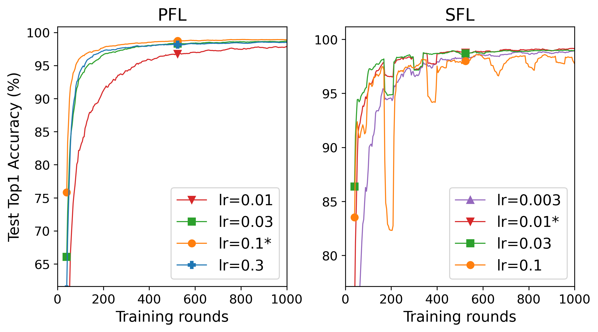
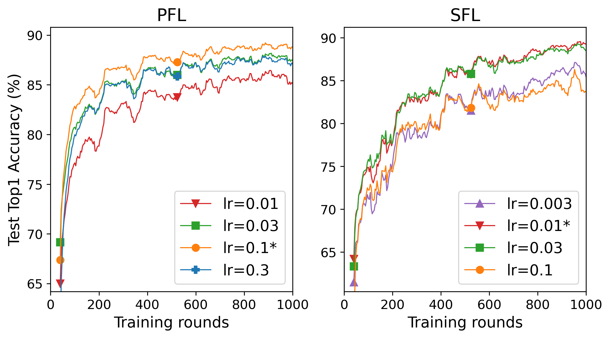
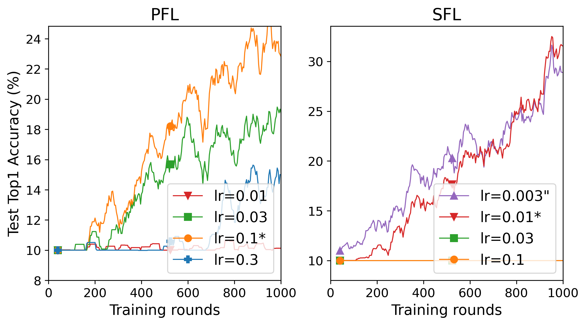
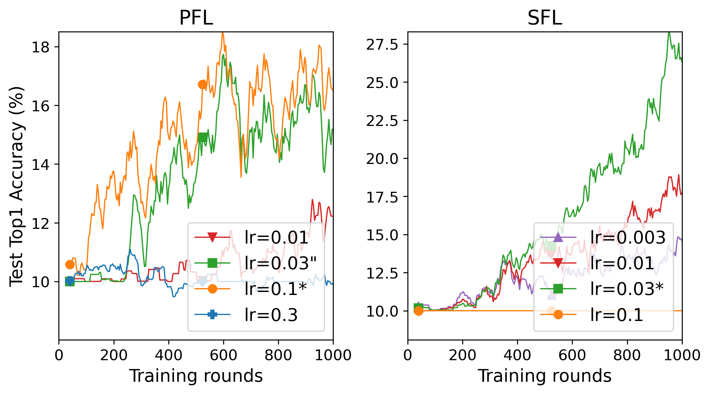

# Convergence Analysis of Sequential Federated Learning on Heterogeneous Data
The implementation of "Convergence Analysis of Sequential Federated Learning on Heterogeneous Data".

- [Environment](#Environment)
- [Commands](#Commands)
- [Findings](#Findings)
  +  [Group normalization](#Group-normalization)
  +  [Construct local datasets](#Construct-local-datasets)
- [Grid search](#Grid-search)
  + [MNIST](#MNIST)
  + [Fashion-MNIST](#Fashion-MNIST)
  + [CIFAR-10](#CIFAR-10)
  + [CINIC-10](#CINIC-10)
- [Quadratic](#Quadratic)
- [Plots](#Plots)

## Environment

```bash
nvidia-smi	# NVIDIA GeForce RTX 4090
nvcc -V 	# cuda-12.1
python -V	# Python 3.10.10
pip list	# torch 2.0.0+cu118, torchvision 0.15.1+cu118
```
## Commands

One simple example of the command

```bash
nohup python main_fedavg.py -m wvgg9k4 -d cifar10 -R 4000 -K 5 -M 500 -P 10 --partition exdir --alpha 1 10.0 --optim sgd --lr 0.1 --global-lr 1.0 --batch-size 20 --seed 1234 --clip 10 --eval-num 1000 --device 0 --save-model 0 &
```

Some arguments:

+ --partition: the partition strategy, we use extended Dirichlet by default.
+ --alpha: the two parameters of Extended Dirichlet strategy.
+ --clip: the max norm of the gradient clipping.
+ --eval-num: the number of rounds to evaluate the training performance, e.g., when the number of the total training rounds is 4000 and the number  of evaluating training rounds is 1000, it means that we evaluate the performance of the algorithms every four training rounds.

Setups:

|           | Algorithm   | MNIST                             | Fashion-MNIST    | CIFAR-10            | CINIC-10            |
| --------- | ----------- | --------------------------------- | ---------------- | ------------------- | ------------------- |
| **Paper** | PFL, SFL    | Logistic Regression, MLP, LeNet-5 | LeNet-5, CNN     | VGG-9, ResNet-18    | VGG-9, ResNet-18    |
| **Code**  | FedAvg, CWT | logistic, mlp, lenet5             | lenet5, cnnmnist | wvgg9k4, resnetii18 | wvgg9k4, resnetii18 |

## Findings

Some interesting findings (see the folder `convergence/findings/`). **Note that these findings are preliminary and more experiments are still required.**

### Group normalization

See the folder `convergence/findings/group_normalization/`. You can use commands below to reproduce the results
```bash
nohup python main_fedavg.py -m {resnetii18, resnetgnii18} -d cifar10 -R 4000 -K 5 -M 500 -P 10 --partition exdir --alpha 1 10.0 --optim sgd --lr 0.1 --global-lr 1.0 --batch-size 20 --seed 1234 --clip 10 --eval-num 1000 --device 0 --save-model 0 &
```

 

[Figure 1: Test accuracy results for cases "with group normalization" and "without group normalization" with the setting ResNet-18 / CIFAR-10 / $K=5$ / $C=1$ (left) and $C=2$ (right).]

**Results.** Group normalization is used widely in FL. However, the experimental results show that the test acc of the case without group normalization is better than that with group normalization, which my be due to the residual connection. This phenomenon is also observed in [1]. As a result, we do not use group normalization in this paper.

[1] Du, Z., Sun, J., Li, A., Chen, P. Y., Zhang, J., Li, H. H., & Chen, Y. (2022, December). Rethinking normalization methods in federated learning. In *Proceedings of the 3rd International Workshop on Distributed Machine Learning* (pp. 16-22).

### Construct local datasets

See the folder `convergence/findings/local_datasets/` and `convergence/findings/local_datasets2/`. You can use commands below to reproduce the resuls
```bash
nohup python {main_fedavg4.py,main_cwt4.py} -m wvgg9k4 -d cifar10 -R 4000 -K 5 -M 500 -P 10 --partition exdir --alpha 1 10.0 --optim sgd --lr 0.1 --global-lr 1.0 --batch-size 20 --seed 1234 --clip 10 --eval-num 1000 --device 0 --save-model 0 &
```

In the code below, we want to construct local datasets according to the map, where the `overallset` is the whole training dataset. 

```python
if way == 1:
    self.fedsets.append(Subset(overallset, net_dataidx_map[i]))
elif way == 2:
    subset = [overallset[j] for j in net_dataidx_map[i]]
    self.fedsets.append(BaseDataset(subset))
```

 

[Figure 2: Test accuracy results for both ways with the setting VGG-9 / CIFAR-10 / $K=5$ / $C=1$ (left) and $C=2$ (right).]

**Results.** We see that *the test accuracy of Way 1 is better than that of Way 2*. This is because everytime we take out one element from the overall training dataset (e.g., `subset = [overallset[j] for j in net_dataidx_map[i]]`), the `transform` will be performed once. Since the data augmentation (`transform`) is performed when constructing local datasets in Way 1 and is performed when training or evalutaing on local datasets in Way 2, it can be expected that the test accuracy of Way 1 is better than Way 2. Note that if no using `RandomCrop()` and `RandomHorizontalFlip()`, the test accuracies in both ways will be the same. Thus, we use Way 1 in this paper. However, *it is also interesting that the training time of Way 1 is more than Way 2*, which we defer to [loca_datasets2](findings/local_datasets2/README.md).

```python
transform_train = transforms.Compose([
        transforms.RandomCrop(32, padding=4),
        transforms.RandomHorizontalFlip(),
        transforms.ToTensor(),
        transforms.Normalize(mean, std),
    ])
```

## Grid search

More results of grid search (see Appendix G.3 Grid search in the paper).

### MNIST

<table>   
    <tr>     
        <td></td>     
        <td></td>     
        <td></td>
    </tr> 
    <tr>
        <td></td>     
        <td></td>     
        <td></td>   
    </tr>
</table>

| MNIST         | Model    | PFL  | SFL   |
| ------------- | -------- | ---- | ----- |
| $C=1$, $K=5$  | Logistic | 0.01 | 0.003 |
| $C=1$, $K=20$ | Logistic | 0.01 | 0.003 |
| $C=1$, $K=50$ | Logistic | 0.01 | 0.003 |
| $C=2$, $K=5$  | Logistic | 0.01 | 0.003 |
| $C=2$, $K=20$ | Logistic | 0.01 | 0.003 |
| $C=2$, $K=50$ | Logistic | 0.01 | 0.003 |

```
'FedAvg_M500_P10_K5_R1000_logistic_mnist_exdir1,10.0_sgd0.01,1.0,0.0,0.0001_b20_seed1234_clip10.csv',
'FedAvg_M500_P10_K20_R1000_logistic_mnist_exdir1,10.0_sgd0.01,1.0,0.0,0.0001_b20_seed1234_clip10.csv',
'FedAvg_M500_P10_K50_R1000_logistic_mnist_exdir1,10.0_sgd0.01,1.0,0.0,0.0001_b20_seed1234_clip10.csv',
'CWT_M500_P10_K5_R1000_logistic_mnist_exdir1,10.0_sgd0.003,1.0,0.0,0.0001_b20_seed1234_clip50.csv',
'CWT_M500_P10_K20_R1000_logistic_mnist_exdir1,10.0_sgd0.003,1.0,0.0,0.0001_b20_seed1234_clip50.csv',
'CWT_M500_P10_K50_R1000_logistic_mnist_exdir1,10.0_sgd0.003,1.0,0.0,0.0001_b20_seed1234_clip50.csv',

'FedAvg_M500_P10_K5_R1000_logistic_mnist_exdir2,10.0_sgd0.01,1.0,0.0,0.0001_b20_seed1234_clip10.csv',
'FedAvg_M500_P10_K20_R1000_logistic_mnist_exdir2,10.0_sgd0.01,1.0,0.0,0.0001_b20_seed1234_clip10.csv',
'FedAvg_M500_P10_K50_R1000_logistic_mnist_exdir2,10.0_sgd0.01,1.0,0.0,0.0001_b20_seed1234_clip10.csv',
'CWT_M500_P10_K5_R1000_logistic_mnist_exdir2,10.0_sgd0.003,1.0,0.0,0.0001_b20_seed1234_clip50.csv',
'CWT_M500_P10_K20_R1000_logistic_mnist_exdir2,10.0_sgd0.003,1.0,0.0,0.0001_b20_seed1234_clip50.csv',
'CWT_M500_P10_K50_R1000_logistic_mnist_exdir2,10.0_sgd0.003,1.0,0.0,0.0001_b20_seed1234_clip50.csv',
```

<table>   
    <tr>     
        <td></td>     
        <td></td>     
        <td></td>
    </tr> 
    <tr>
        <td></td>     
        <td></td>     
        <td></td>   
    </tr>
</table>

| MNIST         | Model | PFL  | SFL   |
| ------------- | ----- | ---- | ----- |
| $C=1$, $K=5$  | MLP   | 0.1  | 0.01  |
| $C=1$, $K=20$ | MLP   | 0.1  | 0.003 |
| $C=1$, $K=50$ | MLP   | 0.1  | 0.003 |
| $C=2$, $K=5$  | MLP   | 0.1  | 0.01  |
| $C=2$, $K=20$ | MLP   | 0.1  | 0.003 |
| $C=2$, $K=50$ | MLP   | 0.1  | 0.003 |

```
'FedAvg_M500_P10_K5_R1000_mlp_mnist_exdir1,10.0_sgd0.1,1.0,0.0,0.0001_b20_seed1234_clip10.csv',
'FedAvg_M500_P10_K20_R1000_mlp_mnist_exdir1,10.0_sgd0.1,1.0,0.0,0.0001_b20_seed1234_clip10.csv',
'FedAvg_M500_P10_K50_R1000_mlp_mnist_exdir1,10.0_sgd0.1,1.0,0.0,0.0001_b20_seed1234_clip10.csv',
'CWT_M500_P10_K5_R1000_mlp_mnist_exdir1,10.0_sgd0.01,1.0,0.0,0.0001_b20_seed1234_clip50.csv',
'CWT_M500_P10_K20_R1000_mlp_mnist_exdir1,10.0_sgd0.003,1.0,0.0,0.0001_b20_seed1234_clip50.csv',
'CWT_M500_P10_K50_R1000_mlp_mnist_exdir1,10.0_sgd0.003,1.0,0.0,0.0001_b20_seed1234_clip50.csv',

'FedAvg_M500_P10_K5_R1000_mlp_mnist_exdir2,10.0_sgd0.1,1.0,0.0,0.0001_b20_seed1234_clip10.csv',
'FedAvg_M500_P10_K20_R1000_mlp_mnist_exdir2,10.0_sgd0.1,1.0,0.0,0.0001_b20_seed1234_clip10.csv',
'FedAvg_M500_P10_K50_R1000_mlp_mnist_exdir2,10.0_sgd0.1,1.0,0.0,0.0001_b20_seed1234_clip10.csv',
'CWT_M500_P10_K5_R1000_mlp_mnist_exdir2,10.0_sgd0.01,1.0,0.0,0.0001_b20_seed1234_clip50.csv',
'CWT_M500_P10_K20_R1000_mlp_mnist_exdir2,10.0_sgd0.003,1.0,0.0,0.0001_b20_seed1234_clip50.csv',
'CWT_M500_P10_K50_R1000_mlp_mnist_exdir2,10.0_sgd0.003,1.0,0.0,0.0001_b20_seed1234_clip50.csv',
```

<table>   
    <tr>     
        <td></td>     
        <td></td>     
        <td></td>
    </tr> 
    <tr>
        <td></td>     
        <td></td>     
        <td></td>   
    </tr>
</table>

| MNIST         | Model   | PFL  | SFL  |
| ------------- | ------- | ---- | ---- |
| $C=1$, $K=5$  | LeNet-5 | 0.1  | 0.03 |
| $C=1$, $K=20$ | LeNet-5 | 0.1  | 0.01 |
| $C=1$, $K=50$ | LeNet-5 | 0.3  | 0.01 |
| $C=2$, $K=5$  | LeNet-5 | 0.1  | 0.01 |
| $C=2$, $K=20$ | LeNet-5 | 0.1  | 0.01 |
| $C=2$, $K=50$ | LeNet-5 | 0.1  | 0.01 |

```
'FedAvg_M500_P10_K5_R1000_lenet5_mnist_exdir1,10.0_sgd0.1,1.0,0.0,0.0001_b20_seed1234_clip10.csv',
'FedAvg_M500_P10_K20_R1000_lenet5_mnist_exdir1,10.0_sgd0.1,1.0,0.0,0.0001_b20_seed1234_clip10.csv',
'FedAvg_M500_P10_K50_R1000_lenet5_mnist_exdir1,10.0_sgd0.3,1.0,0.0,0.0001_b20_seed1234_clip10.csv',
'CWT_M500_P10_K5_R1000_lenet5_mnist_exdir1,10.0_sgd0.03,1.0,0.0,0.0001_b20_seed1234_clip50.csv',
'CWT_M500_P10_K20_R1000_lenet5_mnist_exdir1,10.0_sgd0.01,1.0,0.0,0.0001_b20_seed1234_clip50.csv',
'CWT_M500_P10_K50_R1000_lenet5_mnist_exdir1,10.0_sgd0.01,1.0,0.0,0.0001_b20_seed1234_clip50.csv',

'FedAvg_M500_P10_K5_R1000_lenet5_mnist_exdir2,10.0_sgd0.1,1.0,0.0,0.0001_b20_seed1234_clip10.csv',
'FedAvg_M500_P10_K20_R1000_lenet5_mnist_exdir2,10.0_sgd0.1,1.0,0.0,0.0001_b20_seed1234_clip10.csv',
'FedAvg_M500_P10_K50_R1000_lenet5_mnist_exdir2,10.0_sgd0.1,1.0,0.0,0.0001_b20_seed1234_clip10.csv',
'CWT_M500_P10_K5_R1000_lenet5_mnist_exdir2,10.0_sgd0.01,1.0,0.0,0.0001_b20_seed1234_clip50.csv',
'CWT_M500_P10_K20_R1000_lenet5_mnist_exdir2,10.0_sgd0.01,1.0,0.0,0.0001_b20_seed1234_clip50.csv',
'CWT_M500_P10_K50_R1000_lenet5_mnist_exdir2,10.0_sgd0.01,1.0,0.0,0.0001_b20_seed1234_clip50.csv',
```

### Fashion-MNIST

<table>   
    <tr>     
        <td></td>     
        <td></td>     
        <td></td>
    </tr> 
    <tr>
        <td></td>     
        <td></td>     
        <td></td>   
    </tr>
</table>

| Fashion-MNIST | Model   | PFL  | SFL  |
| ------------- | ------- | ---- | ---- |
| $C=1$, $K=5$  | LeNet-5 | 0.3  | 0.01 |
| $C=1$, $K=20$ | LeNet-5 | 0.3  | 0.01 |
| $C=1$, $K=50$ | LeNet-5 | 0.3  | 0.01 |
| $C=2$, $K=5$  | LeNet-5 | 0.1  | 0.03 |
| $C=2$, $K=20$ | LeNet-5 | 0.1  | 0.03 |
| $C=2$, $K=50$ | LeNet-5 | 0.1  | 0.01 |

```
'FedAvg_M500_P10_K5_R1000_lenet5_fashionmnist_exdir1,10.0_sgd0.3,1.0,0.0,0.0001_b20_seed1234_clip10.csv',
'FedAvg_M500_P10_K20_R1000_lenet5_fashionmnist_exdir1,10.0_sgd0.3,1.0,0.0,0.0001_b20_seed1234_clip10.csv',
'FedAvg_M500_P10_K50_R1000_lenet5_fashionmnist_exdir1,10.0_sgd0.3,1.0,0.0,0.0001_b20_seed1234_clip10.csv',
'CWT_M500_P10_K5_R1000_lenet5_fashionmnist_exdir1,10.0_sgd0.01,1.0,0.0,0.0001_b20_seed1234_clip50.csv',
'CWT_M500_P10_K20_R1000_lenet5_fashionmnist_exdir1,10.0_sgd0.01,1.0,0.0,0.0001_b20_seed1234_clip50.csv',
'CWT_M500_P10_K50_R1000_lenet5_fashionmnist_exdir1,10.0_sgd0.01,1.0,0.0,0.0001_b20_seed1234_clip50.csv',

'FedAvg_M500_P10_K5_R1000_lenet5_fashionmnist_exdir2,10.0_sgd0.1,1.0,0.0,0.0001_b20_seed1234_clip10.csv',
'FedAvg_M500_P10_K20_R1000_lenet5_fashionmnist_exdir2,10.0_sgd0.1,1.0,0.0,0.0001_b20_seed1234_clip10.csv',
'FedAvg_M500_P10_K50_R1000_lenet5_fashionmnist_exdir2,10.0_sgd0.1,1.0,0.0,0.0001_b20_seed1234_clip10.csv',
'CWT_M500_P10_K5_R1000_lenet5_fashionmnist_exdir2,10.0_sgd0.03,1.0,0.0,0.0001_b20_seed1234_clip50.csv',
'CWT_M500_P10_K20_R1000_lenet5_fashionmnist_exdir2,10.0_sgd0.03,1.0,0.0,0.0001_b20_seed1234_clip50.csv',
'CWT_M500_P10_K50_R1000_lenet5_fashionmnist_exdir2,10.0_sgd0.01,1.0,0.0,0.0001_b20_seed1234_clip50.csv',
```

<table>   
    <tr>     
        <td></td>     
        <td></td>     
        <td></td>
    </tr> 
    <tr>
        <td></td>     
        <td></td>     
        <td></td>   
    </tr>
</table>

| Fashion-MNIST | Model | PFL  | SFL  |
| ------------- | ----- | ---- | ---- |
| $C=1$, $K=5$  | CNN   | 0.1  | 0.01 |
| $C=1$, $K=20$ | CNN   | 0.1  | 0.01 |
| $C=1$, $K=50$ | CNN   | 0.1  | 0.01 |
| $C=2$, $K=5$  | CNN   | 0.1  | 0.03 |
| $C=2$, $K=20$ | CNN   | 0.1  | 0.01 |
| $C=2$, $K=50$ | CNN   | 0.1  | 0.01 |


```
'FedAvg_M500_P10_K5_R1000_cnnmnist_fashionmnist_exdir1,10.0_sgd0.1,1.0,0.0,0.0001_b20_seed1234_clip10.csv',
'FedAvg_M500_P10_K20_R1000_cnnmnist_fashionmnist_exdir1,10.0_sgd0.1,1.0,0.0,0.0001_b20_seed1234_clip10.csv',
'FedAvg_M500_P10_K50_R1000_cnnmnist_fashionmnist_exdir1,10.0_sgd0.1,1.0,0.0,0.0001_b20_seed1234_clip10.csv',
'CWT_M500_P10_K5_R1000_cnnmnist_fashionmnist_exdir1,10.0_sgd0.01,1.0,0.0,0.0001_b20_seed1234_clip50.csv',
'CWT_M500_P10_K20_R1000_cnnmnist_fashionmnist_exdir1,10.0_sgd0.01,1.0,0.0,0.0001_b20_seed1234_clip50.csv',
'CWT_M500_P10_K50_R1000_cnnmnist_fashionmnist_exdir1,10.0_sgd0.01,1.0,0.0,0.0001_b20_seed1234_clip50.csv',

'FedAvg_M500_P10_K5_R1000_cnnmnist_fashionmnist_exdir2,10.0_sgd0.1,1.0,0.0,0.0001_b20_seed1234_clip10.csv',
'FedAvg_M500_P10_K20_R1000_cnnmnist_fashionmnist_exdir2,10.0_sgd0.1,1.0,0.0,0.0001_b20_seed1234_clip10.csv',
'FedAvg_M500_P10_K50_R1000_cnnmnist_fashionmnist_exdir2,10.0_sgd0.1,1.0,0.0,0.0001_b20_seed1234_clip10.csv',
'CWT_M500_P10_K5_R1000_cnnmnist_fashionmnist_exdir2,10.0_sgd0.03,1.0,0.0,0.0001_b20_seed1234_clip50.csv',
'CWT_M500_P10_K20_R1000_cnnmnist_fashionmnist_exdir2,10.0_sgd0.01,1.0,0.0,0.0001_b20_seed1234_clip50.csv',
'CWT_M500_P10_K50_R1000_cnnmnist_fashionmnist_exdir2,10.0_sgd0.01,1.0,0.0,0.0001_b20_seed1234_clip50.csv',
```

### CIFAR-10

[Table: The effect of the max norm of the gradient clipping for large synchronization interval ($K=50$).]

| $C=1$, $K=50$ | CIFAR-10, VGG-9 | CINIC-10, VGG-9 | CIFAR-10, ResNet-18 | CINIC-10, ResNet-18 |
| ------------- | --------------- | --------------- | ------------------- | ------------------- |
| clip=0        | 48.29 (0.03)    | 36.47 (0.03)    | 30.34 (0.1)         | 24.40 (0.1)         |
| clip=50       | 48.29 (0.03)    | 36.47 (0.03)    | 29.97 (0.1)         | 26.53 (0.03)        |
| clip=20       | 47.64 (0.03)    | 36.31 (0.03)    | 30.64 (0.1)         | 25.77 (0.1)         |
| clip=10       | 46.21 (0.1)     | 35.18 (0.1)     | 34.68 (0.1)         | 26.57 (0.1)         |


<table>   
    <tr>     
        <td></td>     
        <td></td>     
        <td></td>
    </tr> 
    <tr>
        <td></td>     
        <td></td>     
        <td></td>   
    </tr>
</table>

| CIFAR-10      | Model | PFL                            | SFL                             |
| ------------- | ----- | ------------------------------ | ------------------------------- |
| $C=1$, $K=5$  | VGG-9 | 0.1                            | 0.03                            |
| $C=1$, $K=20$ | VGG-9 | 0.1                            | 0.003                           |
| $C=1$, $K=50$ | VGG-9 | ~~0.03 (28.72)~~, 0.1 (46.21)* | 0.003                           |
| $C=2$, $K=5$  | VGG-9 | 0.1                            | ~~0.01 (82.05)~~, 0.03 (82.18)* |
| $C=2$, $K=20$ | VGG-9 | 0.1                            | 0.01 (81.50)*, ~~0.03 (78.35)~~ |
| $C=2$, $K=50$ | VGG-9 | ~~0.03 (76.14)~~, 0.1 (78.13)* | 0.01                            |


```
#'FedAvg_M500_P10_K1_R4000_wvgg9k4_cifar10_exdir1,10.0_sgd0.1,1.0,0.0,0.0001_b20_seed1234_clip10.csv',
'FedAvg_M500_P10_K5_R4000_wvgg9k4_cifar10_exdir1,10.0_sgd0.1,1.0,0.0,0.0001_b20_seed1234_clip10.csv',
'FedAvg_M500_P10_K20_R4000_wvgg9k4_cifar10_exdir1,10.0_sgd0.1,1.0,0.0,0.0001_b20_seed1234_clip10.csv',
'FedAvg_M500_P10_K50_R4000_wvgg9k4_cifar10_exdir1,10.0_sgd0.1,1.0,0.0,0.0001_b20_seed1234_clip10.csv',
#'CWT_M500_P10_K1_R4000_wvgg9k4_cifar10_exdir1,10.0_sgd0.03,1.0,0.0,0.0001_b20_seed1234_clip50.csv',
'CWT_M500_P10_K5_R4000_wvgg9k4_cifar10_exdir1,10.0_sgd0.03,1.0,0.0,0.0001_b20_seed1234_clip50.csv',
'CWT_M500_P10_K20_R4000_wvgg9k4_cifar10_exdir1,10.0_sgd0.003,1.0,0.0,0.0001_b20_seed1234_clip50.csv',
'CWT_M500_P10_K50_R4000_wvgg9k4_cifar10_exdir1,10.0_sgd0.003,1.0,0.0,0.0001_b20_seed1234_clip50.csv',

#'FedAvg_M500_P10_K1_R4000_wvgg9k4_cifar10_exdir2,10.0_sgd0.1,1.0,0.0,0.0001_b20_seed1234_clip10.csv',
'FedAvg_M500_P10_K5_R4000_wvgg9k4_cifar10_exdir2,10.0_sgd0.1,1.0,0.0,0.0001_b20_seed1234_clip10.csv',
'FedAvg_M500_P10_K20_R4000_wvgg9k4_cifar10_exdir2,10.0_sgd0.1,1.0,0.0,0.0001_b20_seed1234_clip10.csv',
'FedAvg_M500_P10_K50_R4000_wvgg9k4_cifar10_exdir2,10.0_sgd0.1,1.0,0.0,0.0001_b20_seed1234_clip10.csv',
#'CWT_M500_P10_K1_R4000_wvgg9k4_cifar10_exdir2,10.0_sgd0.03,1.0,0.0,0.0001_b20_seed1234_clip50.csv',
'CWT_M500_P10_K5_R4000_wvgg9k4_cifar10_exdir2,10.0_sgd0.03,1.0,0.0,0.0001_b20_seed1234_clip50.csv',
'CWT_M500_P10_K20_R4000_wvgg9k4_cifar10_exdir2,10.0_sgd0.01,1.0,0.0,0.0001_b20_seed1234_clip50.csv',
'CWT_M500_P10_K50_R4000_wvgg9k4_cifar10_exdir2,10.0_sgd0.01,1.0,0.0,0.0001_b20_seed1234_clip50.csv',
```

<table>   
    <tr>     
        <td></td>     
        <td></td>     
        <td></td>
    </tr> 
    <tr>
        <td></td>     
        <td></td>     
        <td></td>   
    </tr>
</table>

| CIFAR-10      | Model     | PFL                           | SFL                             |
| ------------- | --------- | ----------------------------- | ------------------------------- |
| $C=1$, $K=5$  | ResNet-18 | ~~0.1 (53.35)*~~, 0.3 (53.82) | 0.03                            |
| $C=1$, $K=20$ | ResNet-18 | 0.1 (44.66)*, ~~0.3 (34.66)~~ | 0.03                            |
| $C=1$, $K=50$ | ResNet-18 | 0.1                           | 0.01 (69.12), ~~0.03 (65.11)*~~ |
| $C=2$, $K=5$  | ResNet-18 | 0.3                           | 0.03 (86.77), ~~0.1 (83.97)*~~  |
| $C=2$, $K=20$ | ResNet-18 | 0.3                           | 0.03                            |
| $C=2$, $K=50$ | ResNet-18 | 0.3                           | 0.03                            |

```
'FedAvg_M500_P10_K5_R4000_resnetii18_cifar10_exdir1,10.0_sgd0.3,1.0,0.0,0.0001_b20_seed1234_clip10.csv',
'FedAvg_M500_P10_K20_R4000_resnetii18_cifar10_exdir1,10.0_sgd0.1,1.0,0.0,0.0001_b20_seed1234_clip10.csv',
'FedAvg_M500_P10_K50_R4000_resnetii18_cifar10_exdir1,10.0_sgd0.1,1.0,0.0,0.0001_b20_seed1234_clip10.csv',
'CWT_M500_P10_K5_R4000_resnetii18_cifar10_exdir1,10.0_sgd0.03,1.0,0.0,0.0001_b20_seed1234_clip50.csv',
'CWT_M500_P10_K20_R4000_resnetii18_cifar10_exdir1,10.0_sgd0.03,1.0,0.0,0.0001_b20_seed1234_clip50.csv',
'CWT_M500_P10_K50_R4000_resnetii18_cifar10_exdir1,10.0_sgd0.01,1.0,0.0,0.0001_b20_seed1234_clip50.csv',

'FedAvg_M500_P10_K5_R4000_resnetii18_cifar10_exdir2,10.0_sgd0.3,1.0,0.0,0.0001_b20_seed1234_clip10.csv',
'FedAvg_M500_P10_K20_R4000_resnetii18_cifar10_exdir2,10.0_sgd0.3,1.0,0.0,0.0001_b20_seed1234_clip10.csv',
'FedAvg_M500_P10_K50_R4000_resnetii18_cifar10_exdir2,10.0_sgd0.3,1.0,0.0,0.0001_b20_seed1234_clip10.csv',
'CWT_M500_P10_K5_R4000_resnetii18_cifar10_exdir2,10.0_sgd0.03,1.0,0.0,0.0001_b20_seed1234_clip50.csv',
'CWT_M500_P10_K20_R4000_resnetii18_cifar10_exdir2,10.0_sgd0.03,1.0,0.0,0.0001_b20_seed1234_clip50.csv',
'CWT_M500_P10_K50_R4000_resnetii18_cifar10_exdir2,10.0_sgd0.03,1.0,0.0,0.0001_b20_seed1234_clip50.csv',
```

### CINIC-10

<table>   
    <tr>     
        <td></td>     
        <td></td>     
        <td></td>   
    </tr> 
    <tr>     
        <td></td>     
        <td></td>     
        <td></td>   
    </tr> 
</table>

| CINIC-10      | Model | PFL                            | SFL                              |
| ------------- | ----- | ------------------------------ | -------------------------------- |
| $C=1$, $K=5$  | VGG-9 | 0.1                            | 0.01 (59.31), ~~0.03 (57.68)*~~  |
| $C=1$, $K=20$ | VGG-9 | 0.1                            | 0.003 (59.18), ~~0.01 (58.06)*~~ |
| $C=1$, $K=50$ | VGG-9 | ~~0.03 (23.93)~~, 0.1 (35.18)* | 0.003                            |
| $C=2$, $K=5$  | VGG-9 | 0.1 (55.92)*, ~~0.3 (53.18)~~  | 0.01 (60.61), ~~0.03 (59.41)*~~  |
| $C=2$, $K=20$ | VGG-9 | 0.03 (53.18)*, ~~0.1 (52.36)~~ | 0.01                             |
| $C=2$, $K=50$ | VGG-9 | ~~0.03 (50.77)~~, 0.1 (52.42)* | ~~0.003 (57.50)~~, 0.01 (57.91)* |


```
'FedAvg_M1000_P10_K5_R4000_wvgg9k4_cinic10_exdir1,10.0_sgd0.1,1.0,0.0,0.0001_b20_seed1234_clip10.csv',
'FedAvg_M1000_P10_K20_R4000_wvgg9k4_cinic10_exdir1,10.0_sgd0.1,1.0,0.0,0.0001_b20_seed1234_clip10.csv',
'FedAvg_M1000_P10_K50_R4000_wvgg9k4_cinic10_exdir1,10.0_sgd0.1,1.0,0.0,0.0001_b20_seed1234_clip10.csv',
'CWT_M1000_P10_K5_R4000_wvgg9k4_cinic10_exdir1,10.0_sgd0.01,1.0,0.0,0.0001_b20_seed1234_clip50.csv',
'CWT_M1000_P10_K20_R4000_wvgg9k4_cinic10_exdir1,10.0_sgd0.003,1.0,0.0,0.0001_b20_seed1234_clip50.csv',
'CWT_M1000_P10_K50_R4000_wvgg9k4_cinic10_exdir1,10.0_sgd0.003,1.0,0.0,0.0001_b20_seed1234_clip50.csv',

'FedAvg_M1000_P10_K5_R4000_wvgg9k4_cinic10_exdir2,10.0_sgd0.1,1.0,0.0,0.0001_b20_seed1234_clip10.csv',
'FedAvg_M1000_P10_K20_R4000_wvgg9k4_cinic10_exdir2,10.0_sgd0.03,1.0,0.0,0.0001_b20_seed1234_clip10.csv',
'FedAvg_M1000_P10_K50_R4000_wvgg9k4_cinic10_exdir2,10.0_sgd0.1,1.0,0.0,0.0001_b20_seed1234_clip10.csv',
'CWT_M1000_P10_K5_R4000_wvgg9k4_cinic10_exdir2,10.0_sgd0.01,1.0,0.0,0.0001_b20_seed1234_clip50.csv',
'CWT_M1000_P10_K20_R4000_wvgg9k4_cinic10_exdir2,10.0_sgd0.01,1.0,0.0,0.0001_b20_seed1234_clip50.csv',
'CWT_M1000_P10_K50_R4000_wvgg9k4_cinic10_exdir2,10.0_sgd0.01,1.0,0.0,0.0001_b20_seed1234_clip50.csv',
```

<table>   
    <tr>     
        <td></td>     
        <td></td>     
        <td></td>   
    </tr> 
    <tr>     
        <td></td>     
        <td></td>     
        <td></td>   
    </tr> 
</table>

| CINIC-10      | Model     | PFL                                             | SFL                             |
| ------------- | --------- | ----------------------------------------------- | ------------------------------- |
| $C=1$, $K=5$  | ResNet-18 | 0.1 (41.73)*, ~~0.3 (41.00)~~                   | ~~0.01 (58.56)~~, 0.03 (60.06)* |
| $C=1$, $K=20$ | ResNet-18 | 0.1 (34.55)*, ~~0.3 (28.54)~~                   | 0.03                            |
| $C=1$, $K=50$ | ResNet-18 | ~~0.03 (20.27)~~, 0.1 (26.57)*, ~~0.3 (19.88)~~ | 0.03                            |
| $C=2$, $K=5$  | ResNet-18 | 0.3                                             | 0.03 (64.48), ~~0.1 (58.31)*~~  |
| $C=2$, $K=20$ | ResNet-18 | 0.1 (55.43), ~~0.3 (51.15)*~~                   | 0.03                            |
| $C=2$, $K=50$ | ResNet-18 | ~~0.1 (46.09)*~~, 0.3 (47.38)                   | 0.01 (57.56)*, ~~0.03 (52.15)~~ |

```
'FedAvg_M1000_P10_K5_R4000_resnetii18_cinic10_exdir1,10.0_sgd0.1,1.0,0.0,0.0001_b20_seed1234_clip10.csv',
'FedAvg_M1000_P10_K20_R4000_resnetii18_cinic10_exdir1,10.0_sgd0.1,1.0,0.0,0.0001_b20_seed1234_clip10.csv',
'FedAvg_M1000_P10_K50_R4000_resnetii18_cinic10_exdir1,10.0_sgd0.1,1.0,0.0,0.0001_b20_seed1234_clip10.csv',
'CWT_M1000_P10_K5_R4000_resnetii18_cinic10_exdir1,10.0_sgd0.03,1.0,0.0,0.0001_b20_seed1234_clip50.csv',
'CWT_M1000_P10_K20_R4000_resnetii18_cinic10_exdir1,10.0_sgd0.03,1.0,0.0,0.0001_b20_seed1234_clip50.csv',
'CWT_M1000_P10_K50_R4000_resnetii18_cinic10_exdir1,10.0_sgd0.03,1.0,0.0,0.0001_b20_seed1234_clip50.csv',

'FedAvg_M1000_P10_K5_R4000_resnetii18_cinic10_exdir2,10.0_sgd0.3,1.0,0.0,0.0001_b20_seed1234_clip10.csv',
'FedAvg_M1000_P10_K20_R4000_resnetii18_cinic10_exdir2,10.0_sgd0.1,1.0,0.0,0.0001_b20_seed1234_clip10.csv',
'FedAvg_M1000_P10_K50_R4000_resnetii18_cinic10_exdir2,10.0_sgd0.3,1.0,0.0,0.0001_b20_seed1234_clip10.csv',
'CWT_M1000_P10_K5_R4000_resnetii18_cinic10_exdir2,10.0_sgd0.03,1.0,0.0,0.0001_b20_seed1234_clip50.csv',
'CWT_M1000_P10_K20_R4000_resnetii18_cinic10_exdir2,10.0_sgd0.03,1.0,0.0,0.0001_b20_seed1234_clip50.csv',
'CWT_M1000_P10_K50_R4000_resnetii18_cinic10_exdir2,10.0_sgd0.01,1.0,0.0,0.0001_b20_seed1234_clip50.csv',
```

## Quadratic

One simple example of the command

```bash
python quadratic.py -R 500 -K 2  -M 2 -P 2 --F1 0.5 0 --F2 0.5 0 --lr 0 --momentum 0 --weight-decay 0  --seed 0
```

## Plots

Since the plots are quite specialized for our settings, we only public one simple file `plot.ipynb`. We use the `matplotlib` and `seaborn` packages for all figures in the paper (except the Figures 4, 5, where we use [drawio](https://github.com/jgraph/drawio)). Specifically, we use `fill_between()` for Figures 1 and 3, and `bar()` for Figure 2.
