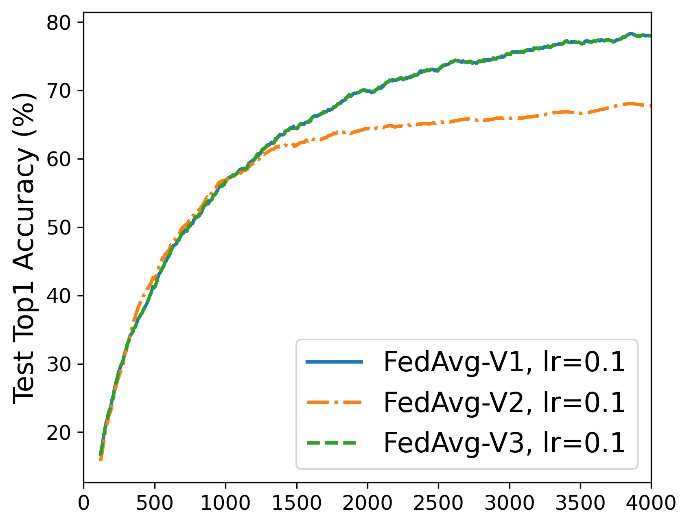

# How to Construct Local Datasets

In this test experiment, we use three ways to constructe the local datasets, and then test their performance (i.e., test accuracy and training time). The code is in "main_fedavg5.py" (other algorithms are similar).

Three ways are given below:
```python
if way == 1:
    self.train_dataset = CIFAR10T(root=data_path, train=True, download=True, transform=transform_train)
    for i in range(len(net_dataidx_map)):
        self.fedsets.append(Subset(self.train_dataset, net_dataidx_map[i]))
elif way == 2:
    self.train_dataset = CIFAR10T(root=data_path, train=True, download=True, transform=transform_train)
    for i in range(len(net_dataidx_map)):
        subset = [self.train_dataset[j] for j in net_dataidx_map[i]]
        self.fedsets.append(BaseDataset(subset))
elif way == 3:
    self.train_dataset = CIFAR10T(root=data_path, train=True, download=True, transform=None)
    for i in range(len(net_dataidx_map)):
        subset = [self.train_dataset[j] for j in net_dataidx_map[i]]
        self.fedsets.append(BaseDataset(dataset=subset, transform=transform_train))
```

## Test accuracy

The test accuracy results of FedAvg are in Figure 1. We see that Way 1 and Way 3 can achieve the same accuracy, yet Way 2 is worse than the others.

<table>
<tr>
<td></img></td>
</tr>
</table>
[Figure 1: Test accuracy results of FedAvg in three ways.]

```bash
nohup python main_fedavg5.py -m wvgg9k4 -d cifar10 -R 4000 -K 5 -M 500 -P 10 --partition exdir --alpha 2 10.0 --optim sgd --lr 0.1 --global-lr 1.0 --batch-size 20 --seed 1234 --clip 10 --eval-num 1000 --device 0 --save-model 0 --way {1,2,3} &
```

## Cost time

To futher study the training time cost of three ways. We add accumulator for the modified dataset object.
```python
class CIFAR10T(CIFAR10):
    def __getitem__(self, index: int):
        # Accumulator 0, Index
        img, target = self.data[index], self.targets[index]

        # Accumulator 1, Load img
        img = Image.fromarray(img)

        # Accumulator 2, Transform
        if self.transform is not None:
            img = self.transform(img)

        if self.target_transform is not None:
            target = self.target_transform(target)

        return img, target
```

We also consider the three stages, i) training on the training sets, ii) evaluting on the training sets, iii) evaluating on the test set.
```python
record_time = [
    'training_index'  , 'training_loadimg'  , 'training_transform'  , 'training_computation',
    'inference1_index', 'inference1_loadimg', 'inference1_transform', 'inference1_computation',
    'inference2_index', 'inference2_loadimg', 'inference2_transform', 'inference2_computation',
]
```

We consider transforms as
```python
transform_train = transforms.Compose([
#            transforms.RandomCrop(32, padding=4),
#            transforms.RandomHorizontalFlip(),
    transforms.ToTensor(),
    transforms.Normalize(cifar10_mean, cifar10_std),
])

transform_test = transforms.Compose([
    transforms.ToTensor(),
    transforms.Normalize(cifar10_mean, cifar10_std),
])
```

```bash
nohup python main_fedavg5.py -m wvgg9k4 -d cifar10 -R 100 -K 5 -M 10 -P 10 --partition exdir --alpha 2 10.0 --optim sgd --lr 0.1 --global-lr 1.0 --batch-size 20 --seed 1234 --clip 10 --eval-num 100 --device 0 --save-model 0 --way {1,2,3} --log Log
nohup python main_fedavg5.py -m wvgg9k4 -d cifar10 -R 100 -K 5 -M 500 -P 10 --partition exdir --alpha 2 10.0 --optim sgd --lr 0.1 --global-lr 1.0 --batch-size 20 --seed 1234 --clip 10 --eval-num 100 --device 0 --save-model 0 --way {1,2,3} --log Log
```
If using the `RandomCrop()` and `RandomHorizontalFlip()`, we can get the cost time (runing on NVIDIA GeForce RTX 4090, cuda 12.0, torch 2.0.0+cu118) as

[Table 1: CIFAR-10/VGG-9/M=10/C=2/K=5/R=100. No that Process time = I1+L1+T1+C1+I2+L2+T2+C2+I3+L3+T3+C3; Process time + Other time = Total time.]

| Way | I1 | <font color=red>L1</font> | <font color=red>T1</font> | C1 | I2 | <font color=red>L2</font> | <font color=red>T2</font> | C2 | I3 | L3 | T3 | C3 | Process time | Other time | Total time |
| -- | -- | -- | -- | -- | -- | -- | -- | -- | -- | -- | -- | -- | -- | -- | -- |
| V1| 0.05| 1.45| 7.34| 6.05| 2.29| 71.17| 360.42| 97.03| 0.29| 13.16| 36.91| 18.80| 614.96| 25.74| 640.70|
| V2| 0.03| 0.00| 0.01| 5.85| 0.42|  0.00|   0.26| 81.02| 0.30| 13.28| 36.17| 18.83| 156.18| 18.68| 174.86|
| V3| 0.03| 0.00| 7.27| 6.08| 0.64|  0.00| 351.07| 96.34| 0.30| 13.28| 36.37| 18.84| 530.22| 21.82| 552.04|

**Results of Table.** We see that the main differences between these ways appear in `loadimg` and `transform` when <u>on training sets</u>. Specifally, we see that i) no time spent on `loadimg` in Ways 2, 3; ii) no time spent on `transform` in Way 2 (the quite little time 0.01 and 0.26 is spent on telling if `self.transform is not None`). The first phenomenon is because we collect all prepared the CIFAR-10 items in a list, which has been already turned into images in Ways 2, 3. The second phenomenon is because `transform` is executed only when constructing the local datasets in Way 2, while `transform` is executed when training and evaluating on training sets. That is also the reason why the test accuracy shows that <u>Way 1 = Way 3 > Way 2</u>. In addition, the differences in total time among the three ways are positively correlated with the number of processing images (see M=10 where each client owns 5000 images and M=500 where each client owns 100 images on average).

[Table 2: CIFAR-10/VGG-9/M=500/C=2/K=5/R=100]

| Way | I1 | <font color=red>L1</font> | <font color=red>T1</font> | C1 | I2 | <font color=red>L2</font> | <font color=red>T2</font> | C2 | I3 | L3 | T3 | C3 | Process time | Other time | Total time |
| -- | -- | -- | -- | -- | -- | -- | -- | -- | -- | -- | -- | -- | -- | -- | -- |
| V1| 0.05| 1.37| 7.05| 6.36| 0.05| 1.41| 7.21| 2.22| 0.30| 13.04| 36.57| 18.85| 94.47| 5.92| 100.40|
| V2| 0.02| 0.00| 0.01| 6.33| 0.01| 0.00| 0.01| 1.95| 0.29| 13.01| 36.15| 18.81| 76.58| 5.71|  82.29|
| V3| 0.02| 0.00| 6.90| 6.36| 0.02| 0.00| 6.97| 2.19| 0.30| 13.07| 36.09| 18.80| 90.72| 5.69|  96.41|

Even if not using `RandomCrop()` and `RandomHorizontalFlip()` (see `FedAvgno`), we can also observe the differences.

[Table 3: CIFAR-10/VGG-9/M=10/C=2/K=5/R=100]

| Way | I1 | <font color=red>L1</font> | <font color=red>T1</font> | C1 | I2 | <font color=red>L2</font> | <font color=red>T2</font> | C2 | I3 | L3 | T3 | C3 | Process time | Other time | Total time |
| -- | -- | -- | -- | -- | -- | -- | -- | -- | -- | -- | -- | -- | -- | -- | -- |
| V1| 0.04| 1.35| 3.78| 6.02| 1.85| 65.52| 180.96| 93.84| 0.29| 13.04| 36.03| 18.67| 421.40| 23.54| 444.95|
| V2| 0.03| 0.00| 0.01| 5.80| 0.29|  0.00|   0.26| 80.77| 0.30| 12.98| 36.15| 18.77| 155.36| 18.63| 174.00|
| V3| 0.03| 0.00| 3.56| 6.03| 0.51|  0.00| 166.02| 91.65| 0.31| 12.90| 36.15| 18.70| 335.86| 20.62| 356.48|

[Table 4: CIFAR-10/VGG-9/M=500/C=2/K=5/R=100]

| Way | I1 | <font color=red>L1</font> | <font color=red>T1</font> | C1 | I2 | <font color=red>L2</font> | <font color=red>T2</font> | C2 | I3 | L3 | T3 | C3 | Process time | Other time | Total time |
| -- | -- | -- | -- | -- | -- | -- | -- | -- | -- | -- | -- | -- | -- | -- | -- |
| V1| 0.04| 1.28| 3.60| 6.33| 0.04| 1.29| 3.60| 2.16| 0.29| 12.88| 35.78| 18.82| 86.12| 5.81| 91.92|
| V2| 0.01| 0.00| 0.01| 6.26| 0.01| 0.00| 0.01| 1.94| 0.29| 13.18| 36.49| 18.74| 76.94| 5.66| 82.60|
| V3| 0.02| 0.00| 3.40| 6.33| 0.01| 0.00| 3.34| 2.09| 0.30| 13.04| 36.12| 18.67| 83.32| 5.64| 88.96|
